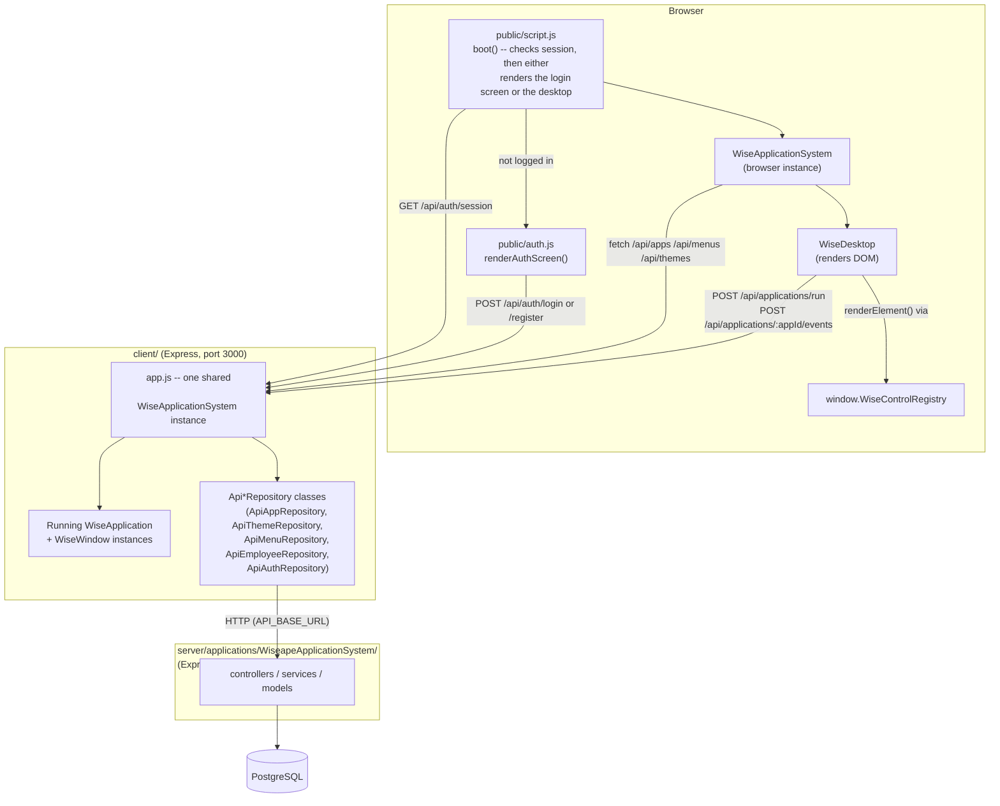
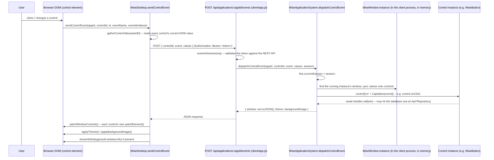
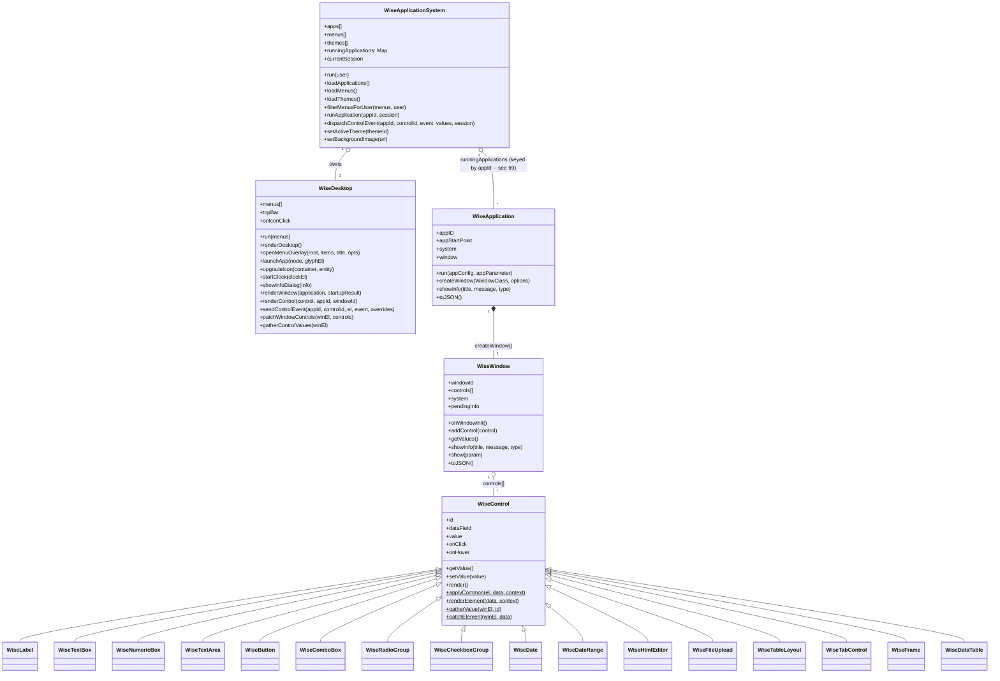
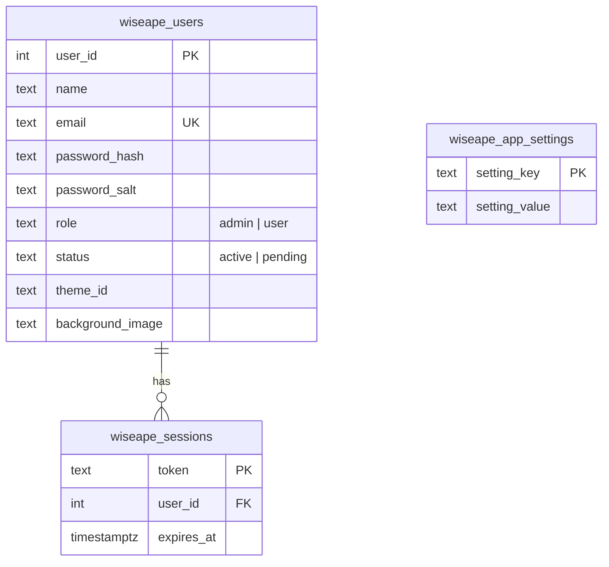
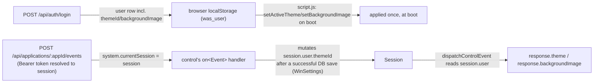
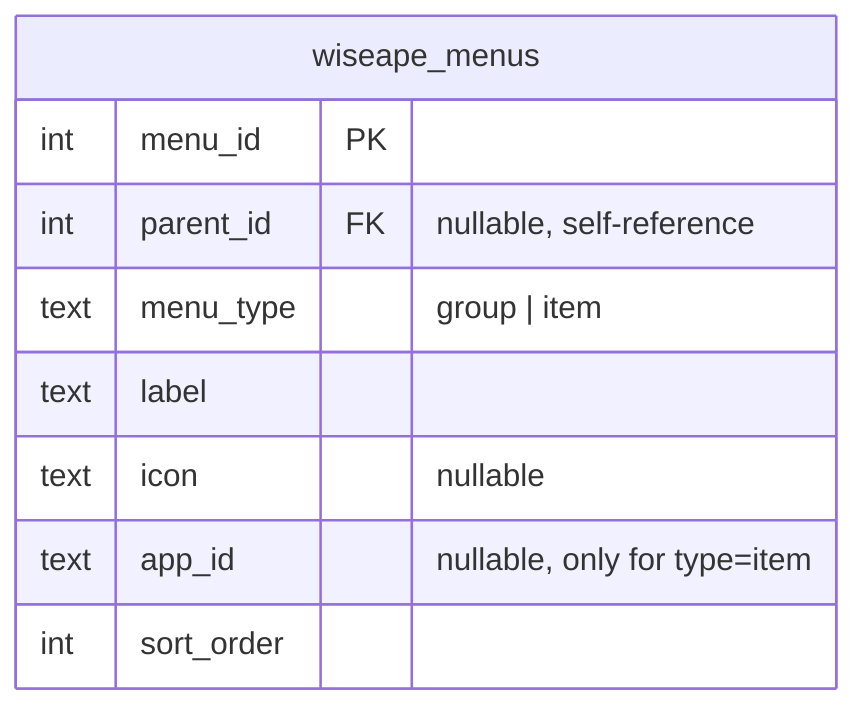

# Wiseape Application System (WAS) — Architecture

> Audience: this document is written for an AI coding agent (or a human
> developer) who needs to understand WAS well enough to modify it safely.
> It explains *why* the system is shaped the way it is, not just what each
> file does — the "why" is what prevents an agent from "fixing" something
> that is actually load-bearing.

## 1. What WAS is

Wiseape Application System is a **browser-based desktop OS simulation**,
split into **two independent Node/Express processes**:

- **`client/`** (port 3000, default) — serves the desktop UI (dock,
  wallpaper, window manager) and hosts "applications": server-side JS
  classes that build windows full of UI controls. Application logic (event
  handlers) runs **inside the client process**, not in the browser — the
  browser only renders DOM and forwards user interactions back over HTTP.
  The client has **no direct database access**; anything it needs (apps,
  menus, themes, employees, auth) it fetches from the REST API server.
- **`server/applications/WiseapeApplicationSystem/`** (port 4000, default)
  — the REST API: the only process that talks to PostgreSQL. Plain
  controller/service/model Express app, no desktop concept at all.

See `docs/RUNNING.md` for how to actually start both. This split exists
specifically so the desktop UI has no database credentials and no direct
DB coupling — every read/write goes through the REST API's own
routes/auth.

An app author writes one thing: a server-side (meaning: inside the
*client* process) window/app class pair under `client/applications/`.
There is no client-side (browser) app logic to write at all — no
build step, no framework dependency (no React/Vue/etc), just plain
JavaScript loaded via `<script>` tags.

## 2. Core design decisions (read this before changing anything)

These are the load-bearing decisions. If you're about to "simplify"
something that looks unusual, check this list first — it's very likely
unusual on purpose.

1. **Isomorphic files.** Most files under `client/system/` and
   `client/system/controls/` run *both* in Node (inside the client
   process) and in the browser, from the exact same source file. Each file
   starts with `const isServer = typeof window === 'undefined';` (or
   `isBrowser`, the inverse) and branches on it. The client's own `app.js`
   `require()`s the file normally for server-side use, and *also* serves it
   raw to the browser via a dedicated route (`/WiseDesktop.js`,
   `/WiseApplicationSystem.js`, `/controls/:file`) — see §7.

2. **IIFE wrapper on every control file.** Every file in
   `client/system/controls/*.js` is wrapped in `(function () { ... })();`.
   This is **not** stylistic. Classic `<script>` tags all share one global
   lexical scope in the browser; without the IIFE, two control files
   declaring `const isBrowser = ...` at top level would collide with a
   `SyntaxError`, and *every control file after the first would silently
   fail to load*. Never remove it.

3. **No client-side (browser) business logic, ever.** An app author never
   writes a browser-side event handler or a browser-side data-fetch. All
   control event handlers (`onClick`, `onChange`, `onRowSelect`, ...) are
   plain methods on a `WiseWindow` subclass, running inside the *client
   Node process*. The browser's only job for an event is: gather current
   form values → POST them to the client's own `/api/applications/:appId/events`
   → apply whatever DOM patch comes back. See §5 for the exact mechanism.

4. **Every control owns its own rendering.** `WiseDesktop` never contains
   per-control-type rendering logic. Each control class in
   `client/system/controls/*.js` implements its own `render()` (server →
   JSON), `static renderElement()` (JSON → DOM), `static gatherValue()`
   (DOM → value), and `static patchElement()` (fresh JSON → update DOM).
   `WiseDesktop` just looks the class up by type name in
   `window.WiseControlRegistry` and calls the method. Adding a new control
   type never requires touching `WiseDesktop.js`.

5. **A container control MUST override `patchElement`.** A control that
   holds other controls (`WiseTableLayout`, `WiseTabControl`, `WiseFrame`)
   has its own child controls nested inside its DOM subtree. If it doesn't
   override `patchElement` to delegate to its children, it inherits the
   base class's generic implementation, which treats the whole container as
   a single value node and corrupts the DOM on the next unrelated event.
   `WiseDataTable` is a partial exception — see its entry in
   `docs/API_REFERENCE.md` for why it fully re-renders itself instead of
   delegating.

6. **The client is a single shared process, not one-instance-per-user.**
   There is exactly one `WiseApplicationSystem` instance in the client
   process, created once at boot (`client/app.js`), and exactly one
   `runningApplications` Map shared by every browser tab/user. Per-user
   behavior (theme, background, admin visibility) is layered on top of this
   shared instance via a **request-scoped session**, not per-user
   instances — see §8 and §9 for exactly how, and the real limitation this
   still leaves.

7. **Every control shares one accessor/event vocabulary.** Every control
   (via the `WiseControl` base class) exposes `getValue()`/`setValue(value)`
   regardless of subtype. `onClick`/`onHover` are similarly generic — wired
   uniformly by `WiseControl.applyCommon(el, data, context)` off two render
   flags (`hasClickHandler`/`hasHoverHandler`), so a control class doesn't
   write its own listener just to support them; only `onChange` stays
   per-control, since what DOM event actually means "changed" genuinely
   differs (native `change`, `blur`, custom logic). A control whose
   `options` naturally includes a list of choices (`WiseComboBox`,
   `WiseRadioGroup`, `WiseCheckboxGroup`) also gets `setItems(items)`/
   `getItems()`. `WiseDataTable` is the one control with enough of its own
   state that `getValue()`/`setValue()` don't fit — it has `getData()`/
   `setData(rows, totalCount)` instead. See `docs/API_REFERENCE.md` for the
   full per-control option/method tables.

8. **Item-based events bridge a public option onto the control's real
   handler, not onto a bare `onChange`.** `WiseComboBox`/`WiseRadioGroup`'s
   `onItemChanged(previousItem, currentItem)` and `WiseCheckboxGroup`'s
   `onItemChecked(item)` need state `dispatchControlEvent` has already
   overwritten by the time any handler runs — control code, not framework
   code, has to remember the *previous* value on the way in. Each of these
   controls wraps its own internal `onChange` in an arrow function (closing
   over the control instance, not relying on `dispatchControlEvent`'s
   `handler.call(win)`) that computes the diff, calls the richer public
   handler if one was supplied, then still calls the plain `onChange` if
   that was *also* supplied — the same bridging pattern `WiseDataTable`
   already established for its own `onFilterchange`/`onRowselect`/
   `onCellchange` internals vs. its public `onDataFilterChanged`/
   `onRowSelect`/column-level `onChange` options. `WiseTabControl`'s
   `onTabChanged(previousTab, currentTab)` follows the same shape, but is
   also the one place this pattern turns a previously **pure client-side**
   interaction (switching tabs never touched the server before) into an
   **optional** server round trip — the visual tab switch itself stays
   instant/client-only either way; the round trip only fires at all when an
   app author actually supplies `onTabChanged`.

## 3. High-level architecture



Two separate `WiseApplicationSystem` instances exist at runtime, both
defined by the same isomorphic source file:

- **Client-process instance** — created once in `client/app.js`'s
  `start()`. Holds the `Api*Repository` instances, `apps`/`menus`/`themes`,
  and `runningApplications`. Lives for the whole process lifetime, shared
  by every HTTP request (see §9).
- **Browser instance** — created once per browser tab in `public/script.js`,
  after the session check succeeds. Holds no repositories at all; it only
  fetches JSON from the client's own routes and renders it via
  `WiseDesktop`.

## 4. Boot sequence

```mermaid
sequenceDiagram
    participant B as Browser
    participant Script as script.js (boot)
    participant Auth as auth.js
    participant Clt as client/app.js
    participant WAS as WiseApplicationSystem (browser)
    participant Desk as WiseDesktop (browser)

    B->>Script: page load
    Script->>Script: read localStorage.was_token
    alt token present
        Script->>Clt: GET /api/auth/session (Bearer token)
        Clt-->>Script: { user } or error
    end
    alt no valid session
        Script->>Auth: renderAuthScreen(root, {onAuthenticated})
        B->>Auth: submit login/register form
        Auth->>Clt: POST /api/auth/login or /register
        Clt-->>Auth: { user, token }
        Auth->>B: localStorage.setItem('was_token', token)
        Auth->>Script: onAuthenticated(user)
    end
    Script->>WAS: new WiseApplicationSystem({root}); run(user)
    WAS->>Clt: GET /api/apps, /api/menus, /api/themes
    Clt-->>WAS: apps[], menu tree, themes[]
    WAS->>Desk: desktop.run(visibleMenus)
    Desk->>B: render topbar, dock, desktop-grid icons
    Script->>WAS: setActiveTheme(user.themeId) / setBackgroundImage(user.backgroundImage)
```

Key files: `client/public/auth.js` (`renderAuthScreen`), `client/public/script.js`
(`boot()`, `startDesktop(user)` — both plain top-level functions in that
file, nothing exposed as a documented global), `client/system/WiseApplicationSystem.js#run()`.

The token is stored in `localStorage` under `was_token` (and the last-known
user under `was_user`) with a 30-day server-side expiry
(`wiseape_sessions.expires_at`, checked by the REST API on every
`GET /api/auth/session` call) — there is no separate "remember me" flow,
every login just always issues a 30-day token.

## 5. The control-event round trip (the core mechanism)

This is the single most important flow to understand. It is what lets an
app author write `onClick: this.mySaveHandler.bind(this)` and have it "just
work" as a real method call inside the client process, with no browser-side
registration of any kind.



Important details baked into this flow:

- **Handler resolution is generic.** `dispatchControlEvent` computes
  `` `on${Capitalize(eventName)}` `` and looks it up **on the control
  instance**. App-author handlers are `.bind(this)`'d to the window when
  constructed, so `this` inside them is the window regardless of how
  they're invoked. A few controls (`WiseDataTable`) instead define their
  own handlers as **arrow functions assigned in the constructor**
  (`this.onCellchange = () => {...}`), specifically so `this` stays the
  control instance even though `dispatchControlEvent` calls
  `handler.call(win)` — arrow functions ignore `.call()`'s `this` override.
- **The handler is `await`ed.** `dispatchControlEvent` is `async` and does
  `await handler.call(win)`. This is what lets a handler perform a real
  database write (via an `Api*Repository`, e.g. an admin approving a user,
  or `WinSettings` saving a theme change) and have that write actually
  finish before the HTTP response — and therefore the DOM patch — goes out.
- **`session` is request-scoped, not stored per-instance.** Every event
  dispatch re-resolves the caller's session from the Bearer token
  (`client/app.js`'s `resolveSession(req)`) and stashes it as
  `this.currentSession` on the *shared* `WiseApplicationSystem` instance
  right before invoking the handler, synchronously, in the same tick. A
  handler that needs to know who's calling (e.g. `WinAdmin`'s approve
  button) reads `this.system.currentSession.{user,token}`. See §8/§9 for
  why this is safe in practice but not bulletproof under real concurrency.
- **Theme/background echo is per-user, not global.** The response's
  `theme`/`backgroundImage` fields are read from `session.user` when a
  session is present (falling back to the shared system-wide values
  otherwise) — **not** from a shared system-wide setting. This is what
  stops one user's theme change from bleeding into another user's view;
  see §8.
- **There is no multi-window-per-app / dialog system.** Unlike a more
  elaborate design you might expect, a `WiseWindow` cannot open *another*
  window mid-session and have it delivered to the browser — the round trip
  above only ever carries exactly one `window` per response. For an
  in-window alert/notification, use `this.showInfo(title, message, type)`
  instead (§9 below) — it's a modal overlay delivered through this exact
  same `window.info` field, not a second window.

## 6. Class map



Note `WiseWindow` has **no** `createWindow()`/`childWindows` — only
`WiseApplication` can create a window (its one main window). Full
method-by-method reference: see `docs/API_REFERENCE.md`.

## 7. How files reach the browser

`client/applications/**` is **never** statically served — it holds
server-side (client-process) Node code (`require()`d directly by
`resolveApplicationClass`) and must not be exposed as raw downloadable
files. Instead, `client/app.js` whitelists exactly what the browser is
allowed to fetch:

| Route | Serves |
|---|---|
| `express.static('public/')` | everything under `client/public/` (HTML, CSS, `auth.js`, `script.js`, uploaded background images) |
| `GET /WiseDesktop.js` | `client/system/WiseDesktop.js` |
| `GET /WiseApplicationSystem.js` | `client/system/WiseApplicationSystem.js` |
| `GET /controls/:file` | `client/system/controls/<file>.js`, regex-whitelisted to `^Wise[A-Za-z]+\.js$` |
| `GET /app-assets/:appId/icon.svg` | that app's own `assets/icons/icon.svg`, resolved from its `appStartPoint` — see §10 |

`client/public/index.html` loads all of the above via plain `<script>`
tags, in a specific order: `WiseControl.js` first (every other control
class extends it), then the rest of the controls, then `WiseDesktop.js`,
then `WiseApplicationSystem.js`, then `auth.js`, then `script.js` last
(it's the one that actually boots).

## 8. Authentication, sessions, and per-user state

All auth data lives in PostgreSQL, owned by the REST API server
(`server/applications/WiseapeApplicationSystem/src/models/authModel.js`) —
the client never touches these tables directly, only through
`client/system/ApiAuthRepository.js` (a thin `fetch` wrapper) and, for the
browser-facing subset, `client/app.js`'s own `/api/auth/*` proxy routes.



- Passwords are hashed with Node's built-in `crypto.scryptSync` (salted,
  per-user salt) — no external hashing dependency.
- A session token is a random 32-byte hex string, valid 30 days.
- `wiseape_app_settings` currently holds one row,
  `registration_requires_approval`, toggled from the **Admin** app
  (`client/applications/Admin/forms/WinAdmin.js`) and read by
  `authModel.createUser()` to decide whether a new signup's `status`
  starts as `'active'` or `'pending'`.
- The seeded admin account's email/password come from `ADMIN_EMAIL`/
  `ADMIN_PASSWORD` env vars on the REST API server (defaulting to a
  placeholder if unset) — **not** hardcoded in source, specifically so a
  real credential never ends up committed to a public repo.

**Per-user theme/background propagation** — this is the part most likely
to surprise someone extending the system, since the client has exactly
*one* `WiseApplicationSystem` instance shared by every connected browser:



The `session` object passed into `runApplication`/`dispatchControlEvent`
is **resolved fresh from the Bearer token on every single request** — it
is not cached between requests. If a handler changes the user's stored
preference (see `WinSettings.onThemeChange`/`.onBackgroundChange`), it
must **also** mutate that same in-memory `session.user` object
immediately, synchronously, before the handler returns — otherwise the
*very same* response (the one confirming the change) would still echo the
stale value, since the DB write and the response are racing and the
response doesn't re-fetch. See `WinSettings.persistPreferences` for the
reference implementation.

## 9. Known architectural limitations (flagged deliberately, not accidental)

**One running instance per appId.** `WiseApplicationSystem.runningApplications`
is a single `Map<appId, WiseApplication instance>`, shared by the whole
client process. Every time `runApplication(appId, session)` runs (i.e.
every time *any* browser session opens app X), it **overwrites** the
previous entry for that `appId`. Practical consequence: if two different
logged-in users (or two browser tabs) have the same app open at the same
time, control events from the *first* tab's window may dispatch against
whatever instance is currently in the map — which may by then belong to
the *second* tab's session. Fixing this properly would mean keying
`runningApplications` by something like `(appId, userId, windowId)`
instead of just `appId`. If you're asked to support genuinely concurrent
multi-user use of the same app, **this is the first thing to fix**.

**`currentSession` has a narrow race window.** Because it's stashed on the
shared system instance right before a handler runs, a handler that
`await`s something mid-execution (e.g. a database call) could in
principle have `this.system.currentSession` reassigned by a *different*,
concurrent request before it resumes. `dispatchControlEvent` mitigates
this for its own *response* by capturing `session` into a local variable
before awaiting the handler (so the echoed theme/background can't leak
across requests), but a handler that reads `this.system.currentSession`
itself *after* an internal `await` is not protected the same way. In
practice, for this app's scale, this has not been an issue — but a true
fix (per-request context instead of a shared mutable field) would be a
larger change.

## 10. Per-app colorful icons

Every application folder can carry its own icon:

```
client/applications/<AppName>/assets/icons/icon.svg
```

`GET /app-assets/:appId/icon.svg` (in `client/app.js`) resolves an app's
folder from its `appStartPoint` (e.g.
`applications/HelloWorld/AppHelloWorld.js:AppHelloWorld` → folder
`applications/HelloWorld`) and serves that file if it exists (double-checked
to stay inside `applications/`), 404s otherwise.

Icon *authoring* is file-based; the database `app_icon` (and a menu row's
own `icon` column) is only ever a **fallback glyph**, never the source of
truth once a real file exists. `WiseDesktop.getIconMarkup()` always
renders the fallback glyph first (so there's never a blank icon), and
`WiseDesktop.upgradeIcon()` probes the file in the background, swapping in
an `` only once it's confirmed to actually
load — see the doc comment on `upgradeIcon` for exactly why (avoids ever
showing a broken-image icon).

Icon SVGs are drawn on a `128×128` canvas, edge-to-edge (a full `rx="28"`
rounded rect background, no inset margin) — the four bundled apps
(HelloWorld, Settings, Controls, Admin) all have one; see
`docs/DEVELOPMENT_GUIDE.md` §10 for the template.

## 11. The menu system

Desktop icons and Launchpad are driven by a **menu tree**, not the flat app
list. The tree is built entirely on the REST API server
(`server/applications/WiseapeApplicationSystem/src/services/menusService.js`,
table `wiseape_menus`) and delivered to the client already-built —
`client/system/ApiMenuRepository.js` just relays it.



- A `group` row is a folder; an `item` row links to an app via `app_id`.
- Groups can nest arbitrarily deep (`parent_id` self-reference).
- Icon resolution (server-side, in `menusService.js`): an explicit `icon`
  column wins; otherwise an `item` inherits its linked app's `appIcon`, and
  a `group` defaults to a folder glyph (`📁`).
- `WiseApplicationSystem.filterMenusForUser(menus, user)` (client-side, in
  the browser) recursively drops the admin-only item (and any group left
  empty as a result) for non-admin viewers — this is purely a *display*
  filter; `AppAdmin.run()` also independently enforces the role check
  server-side, so a non-admin can't reach it even by guessing the appId.
- `WiseDesktop`'s desktop-grid rendering and the Launchpad trigger both
  consume this same tree, via the same `openMenuOverlay()` method
  (Launchpad is just `openMenuOverlay(root, this.menus, 'Launchpad')`) —
  clicking a folder anywhere **stacks** another overlay on top rather than
  replacing the current one; a `closers` array is threaded through the
  recursive calls so that launching an app from several folders deep still
  closes the *entire* stack, not just the folder it happened in.
- The **dock** (taskbar) is intentionally *not* menu-tree-shaped — it's the
  same tree flattened to just its leaf items (`flattenMenuItems`), by
  design (a deliberate scoping decision: the desktop surface shows the
  menu/folder structure, the dock stays a flat quick-launch strip like a
  real macOS dock).

## 12. Repository patterns — two different ones, don't mix them up

**Client-side (`client/system/Api*Repository.js`)** — thin `fetch`
wrappers around the REST API server, nothing more. Constructor takes
`{ baseUrl }` (defaulting to `process.env.API_BASE_URL`); one method per
REST endpoint; on failure, most of them (apps/themes/menus/employees) fall
back to a small hardcoded default so the desktop never completely fails to
boot just because the REST API is briefly unreachable
(`ApiAuthRepository` is the one exception — auth failures should be loud,
not silently faked). Copy this pattern for a new client-side data source
that talks to the REST API. See `docs/DEVELOPMENT_GUIDE.md` §6.

**REST API-side (`server/.../src/models/*Model.js`)** — the ones that
actually touch PostgreSQL, via `config/db.js`'s pooled client
(`pool.on('error', ...)` is required there too, for the same
crash-on-dropped-connection reason). Idempotent `ensureSchema()`-style
seeding, memoized with a `schemaReady`/similar flag so it only runs once
per process. If you're adding a genuinely new *database-backed* feature,
it belongs here, not in `client/`.

## 13. File/folder map

```
client/
  app.js                         Express server (port 3000): all client
                                  routes, one process-wide
                                  WiseApplicationSystem instance
  public/
    index.html                   Script tags, load order
    styles.css                   Desktop/dock/window chrome (controls
                                  themselves use Tailwind utility classes
                                  directly in their renderElement)
    auth.js                      renderAuthScreen() -- login/register UI
    script.js                    boot() -- entry point, session check,
                                  desktop bootstrap
    uploads/                     User-uploaded background images (gitignored)
  system/
    WiseApplicationSystem.js     Orchestrator -- isomorphic (see §1)
    WiseDesktop.js                Desktop/dock/window-chrome rendering -- isomorphic
    WiseApplication.js            Base class for an installed app
    WiseWindow.js                 Base class for a window
    Api*Repository.js             Client-side REST API clients (see §12)
    controls/
      WiseControl.js               Base control class + registry bootstrap
      Wise*.js                     One file per control type (see docs/API_REFERENCE.md)
  applications/
    <AppName>/
      App<AppName>.js              extends WiseApplication, implements run()
      forms/
        Win<Name>.js                extends WiseWindow, implements onWindowInit()
      assets/icons/icon.svg         Optional colorful app icon (see §10)
server/applications/WiseapeApplicationSystem/
  app.js                          Express REST API (port 4000)
  config/db.js                    pg Pool
  src/
    routes/                        One router file per resource, mounted in index.js
    controllers/                   Thin req/res glue
    services/                      Business logic (e.g. menusService builds the tree)
    models/                        The only files that touch PostgreSQL
    middleware/auth.js              Bearer token parsing, requireUser/requireAdmin
    utils/password.js               scrypt hash/verify
docs/
  ARCHITECTURE.md                 This file
  DEVELOPMENT_GUIDE.md             Tutorial for building a new WAS application
  API_REFERENCE.md                 Class/method reference
  RUNNING.md                       How to actually start both processes
```
